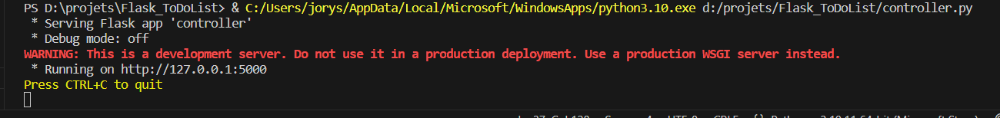
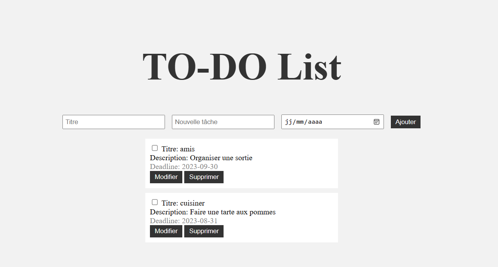
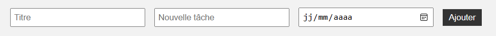
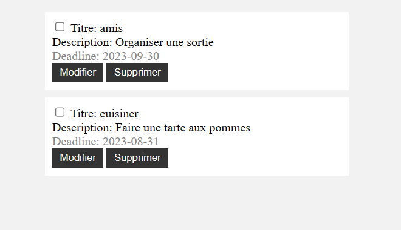
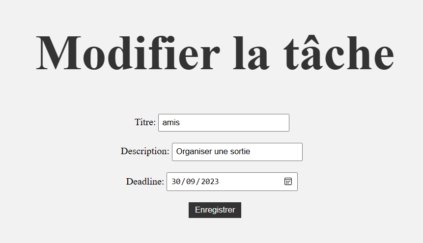

# ToDo List par l'approche MVC

Bienvenue dans la documentation de ma Todolist, un projet scolaire développé en utilisant l'approche Modèle-Vue-Contrôleur (MVC). 
Cette application offre une solution efficace pour la gestion de tâches quotidiennes, en suivant une structure bien définie qui sépare les données, 
la logique métier et l'interface utilisateur. Grâce à cette conception, la Todolist garantit une expérience utilisateur fluide. 
Explorez cette documentation pour découvrir comment utiliser cette application afin de mieux organiser vos activités au quotidien.

## Arborescence des fichiers

* templates
  * index.html
  * edit.html
* static
  * style.css
* controller.py
* model.py
* tdlist.db
* readme.md (ici)
 
### Fichiers et utilités

controller.py: Le controller selon l’approche MVC récupère les entrées de l’utilisateur depuis
la vue et effectue des actions sur le modèle via des fonctions.

model.py: Le modèle s’occupe du traitement et de la gestion des données. Il est doté de
plusieurs fonctions, notamment la création de la base de données, l’insertion et leur mise à
jour…

tdlist.db: Fichier de base de données contenant la structure de la table ainsi que les tâches
de la ToDo liste.

index.html: Avec le fichier edit.html, ils constituent la Vue selon l’approche MVC, ils servent à
voir les données, ici les tâches. index.html permet d’ajouter une tâche en rentrant ses
caractéristiques.

edit.html: edit.html permet de modifier une tâche après sa création.

style.css: Sert à styliser les pages html de notre application.

## Lnacement de l'application

- Ouvrez votre IDE avec le dossier Flask_ToDoList
- Lancez le fichier controller.py

- Cliquez sur le lien qui suit "Running on"
  
## Utilisation de la ToDo List

Vous voici sur la ToDo liste:

### Ajout de tâches
  
Afin d’ajouter une tâche, vous devez remplir tous les champs et cliquer sur “Ajouter”.  
**Attention**: S’il reste des champs vides lors de la validation, un message d’erreur sera affiché et la tâche ne sera pas ajoutée.  
De la même manière, si vous entrez une deadline pour une date déjà passée, le site vous
affichera un message d’erreur et la tâche ne sera pas ajoutée.

### Affihcage des tâches
  
Ici va s’afficher la liste des tâches, leur affichage comprend: le titre, la description ainsi que la deadline.  
À côté du titre vous avez une checkbox qui sert à compléter une tâche, lorsque vous avez
fini votre tâche, vous cochez la checkbox ce qui aura pour effet de barrer la tâche et
de la replacer à la fin de la liste des tâches.
Vous avez ensuite les deux boutons “Modifier” et “Supprimer”

### Suppression d'une tâche  
Le bouton “Supprimer” va simplement supprimer la tâche de la base de données ainsi que dans la liste de tâches affichée sur la page

### Modification d'une tâche  
Le bouton “Modifier” va ouvrir la seconde page html permettant l'édition de la tâche choisie:
  
Vous aurez donc la possibilité de modifier les caractéristiques apparentes de votre tâche,
tels le titre, la description et la deadline.  
En appuyant sur “Enregistrer” la tâche sera alors modifiée et vous retournerez
automatiquement sur la page d’affichage des tâches.

